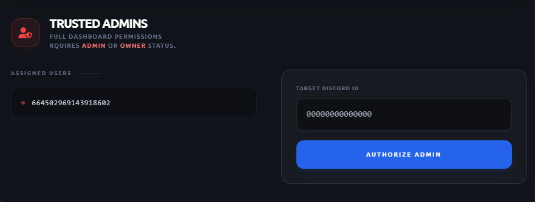
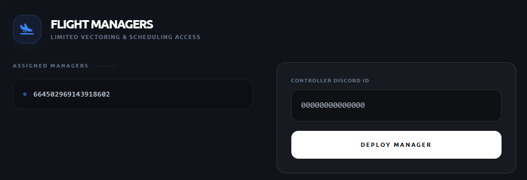

# Dashboard Settings

Avio has its own advanced dashboard, allowing you to easily edit and configure settings and features
within the Avio network.

## Accessing the Dashboard

1. Head to the [dashboard](https://dashboard.aviobot.app) and Log In with Discord
2. Select the server you wish to edit from the server selection
3. Once in, select any section from the sidebar and your ready to go

!!! warning "Permission Required"
    To access the dashboard, you need to have permission, which can be gained through the following:
  
    -Being the server owner
    -Having the Discord Administrator Permission
    -Being a trusted user
    -Being a flight manager

    Below explains how to get the last two permissions

### Adding a Trusted User

Adding a trusted user allows them to access the dashboard without requiring any Discord permissions.
It allows you to give permission to specific users, rather than an entire role.
Use the following steps to add a Trusted User

1. Head to the [dashboard](https://dashboard.aviobot.app) and Log In with Discord
2. Select the **Settings** tab on the sidebar
3. Under the **Trusted Admins** section, add the userID of the user you wish to give trust to

{ width="600" }
*Settings Tab "Add Trusted User" screen*

### Adding a Flight Manager

Adding a flight manager allows you to give access the flight-management parts of the dashboard without
requiring any Discord permissions, and without having to give complete dashboard access.
It allows you to give flight-managers the ability to plan flights.
Use the following steps to add a Flight Manager

1. Head to the [dashboard](https://dashboard.aviobot.app) and Log In with Discord
2. Select the **Settings** tab on the sidebar
3. Under the **Flight Managers*8 section, add the userID of the user you wish to give trust to

{ width="600" }
*Settings Tab "Add Flight Manager" screen*

### Getting a users userID

1. Head to User Settings on Discord
2. Scroll down to the bottom and click the Developer tab
3. Enable Developer Mode
4. Right click the users profile/name
5. Click **Copy User ID** at the bottom

## Purging Server Data
If you wish to purge all your server data, you can do so via the dashboard.

1. Head to the [dashboard](https://dashboard.aviobot.app) and Log In with Discord
2. Select the **Settings** tab on the sidebar
3. Scroll down to the bottom and hit **Purge Data**
4. Accept the verification message

!!! danger "ACTION CANNOT BE UNDONE"
    Purging server data cannot be undone. The data cannot be recovered.
    Please use this at your own risk.

    Team Avio is not liable for any accidental use of this feature.
