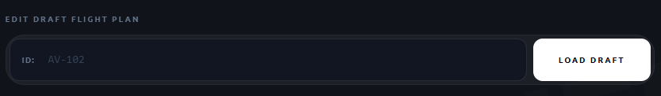

# Flight Management

Avio's flight management features allow virtual airlines to plan flights
with ease, straight from Discord and our advanced web dashboard. Easily
keep your passengers alerted with upcoming flights.

## Scheduling a Flight

1. Run `/flight-planner [flightID]` to create a draft flight
2. Head to the [dashboard](https://dashboard.aviobot.app) and log in with Discord
3. Navigate to **Flight Planner** in the sidebar
4. Enter your flight ID and click **Load Draft**
5. Fill in the flight details
6. Click **Save**, then **Publish to Discord**

!!! warning "Unique flight IDs"
    You cannot have multiple flights with the same flight ID. For example, `BA471m`.

### Accessing the Dashboard Flight Planner

!!! note "Permissions required"
    You need to be a **Trusted User** or **Flight Manager** on the dashboard
    to access the Flight Planner. See [Dashboard Settings](../dashboard-settings.md)
    for details on getting these roles.

### Filling in Details for a New Flight

Before you can fill in the flight details, you need to load your draft flight.

{ width="600" }
*The Flight Planner "load draft" screen*

Enter the flight ID you created earlier, then click **Load Draft**. You'll
be taken into the flight editor, where you can fill in the remaining fields.

Once everything looks right, click **Save**, then **Publish to Discord** —
your flight plan will be posted to your flights channel.

### Editing an existing Flight
If you wish to edit an existing flight, it is a easy process to do.

1. Head to the [dashboard](https://dashboard.aviobot.app) and log in with Discord
2. Navigate to the **Flight Planner** in the sidebar
3. Enter your channel ID and flightID then click **Edit Live Embed**
4. Change the details you wish to edit
5. Click **Save**, then **Publish to Discord**

This will not create a new flight embed, but rather edit the existing one.

!!! note Matching Data Fields Required
    When editing a flight, you need to make sure the channel ID is the same one
    the flight is published in. Providing mixmatched data will result in an error.

{ width="600" }
*The Flight Planner "Edit Live Embed" screen*

### Removing an existing Flight
If you wish to remove an existing flight, it is a simple command.

Run `/remove-flight [flightID]` to remove a flight.

!!! danger "Action CANNOT be undone"
    Removing a flight permanently deletes all data associated with the flight, including any bookings.
    This action cannot be undone, and no data can be recovered.
    Please only use this command if you are 100% sure you want to remove the flight.

## Status Notifications

15 minutes before a flight is due to depart, Avio will send a message and ping all users who have booked a seat on that flight, 
alerting them that the flight is about to begin.

!!! note "Notification delivery"
    Notifications are sent to whichever channel configured in your **Server Setup**.

--- 

!!! tip
    You can give server members the flight manager permission which will allow them to manage flight details.
    This is a safer way of giving someone access to the dashboard, rather than granting full permission.
    Only give these permissions to trusted users.
